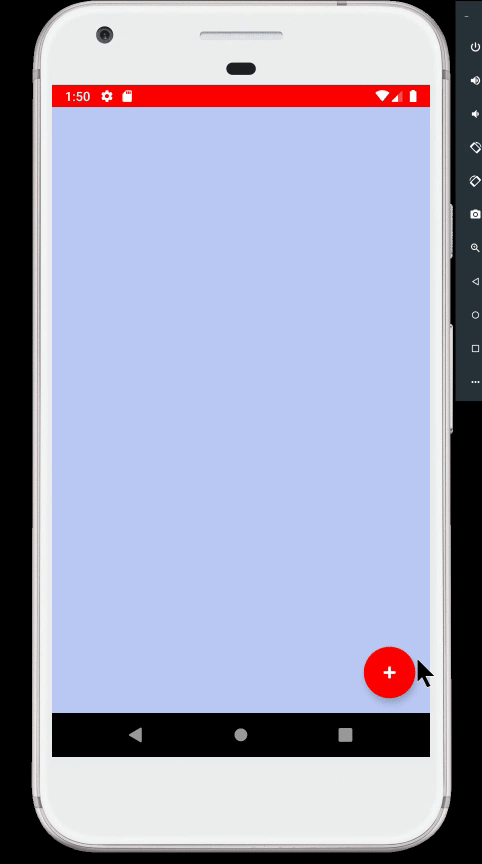
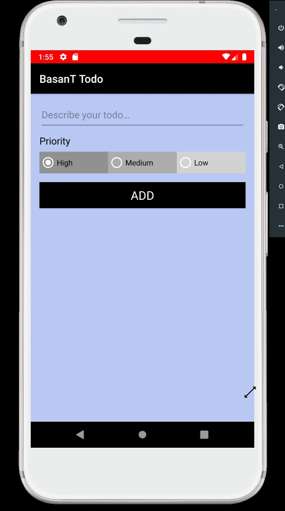
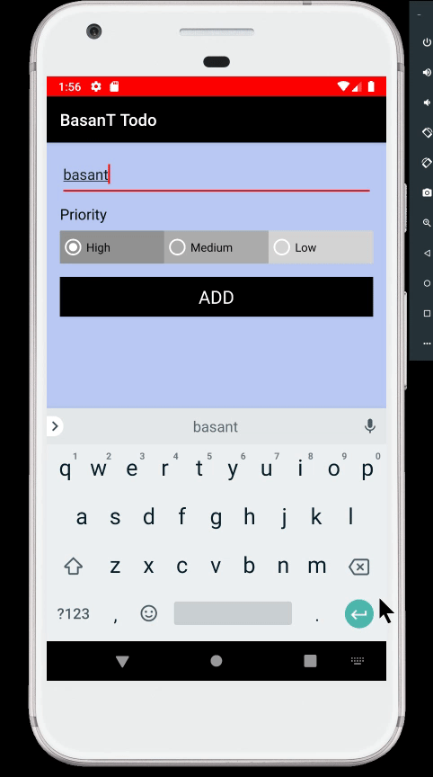
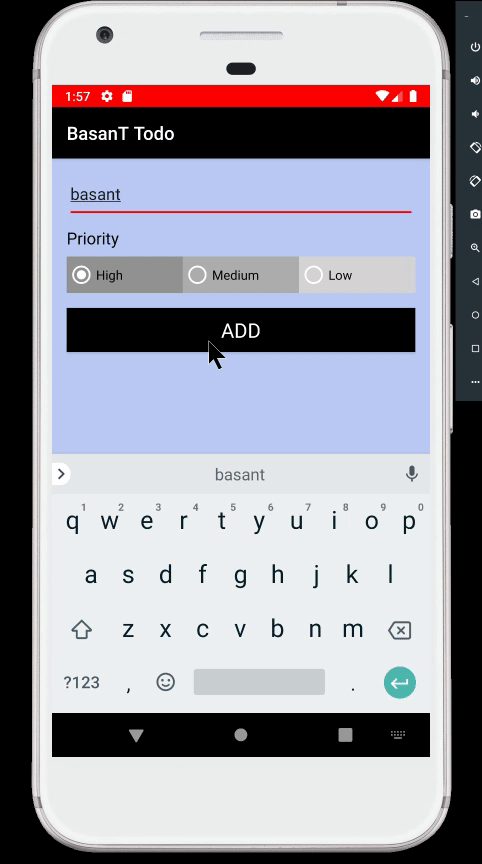
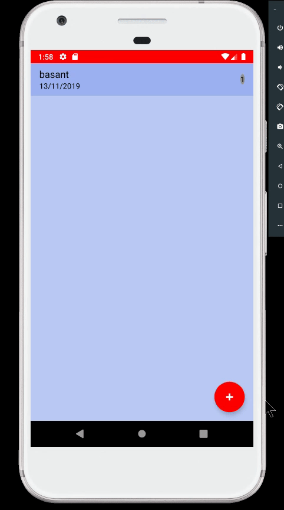
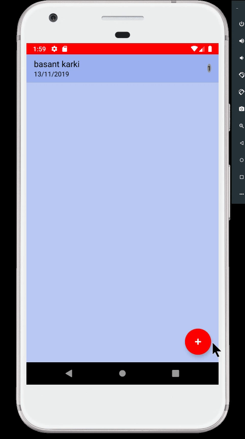

# finalprojectbasant-

**Basant Todo android application (Introduction)**
Basant Todo is an android software that allows users to add their normal daily activities. Enable the specifics of the Task to be prioritize, changed and removed.

Graphics Interchange Format Walkthrough:

above GIF shows how to create the TO-DO in basant todo applicatio.

above GIF shows the text area in basant todo application where user can describe their TODO.

above GIF shows how to set the priority of the TO-DO added by user.

above GIF shows how to add the TO-DO in the list.

above GIF shows how to update previous TO-DOs from the list.

above GIF shows how to delete the TO-DO from the list.

**Functionalites and Features**
1. User can add TO-DO in the list.
2. User can priotize the TO-DO.
3. user can tap on TO-DO to update them.
4. User can swipe the TO-DO from the list to delete them.

**Framework Used**
Model–view–viewmodel (MVVM) is one of the architectural patterns which enhances separation of concerns, it allows separating the user interface logic from the business (or the back-end) logic. Its target (with other MVC patterns goal) is to achieve the following principle “Keeping UI code simple and free of app logic in order to make it easier to manage”.

**Used Components**
MVVM framework
Adapters
Fragments
View Pagers

**Prerequisties**
Android Studio (IDE)
Android SDK v28

**Libraries Used**
LiveData
ViewModel
Room

License
Copyright 2019 Basant karki_77209973. The British College.